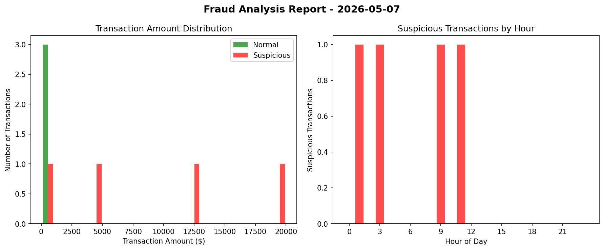

# 💰 Financial Alert System - Fraud Detection

> A production-ready fraud detection system that analyzes financial transactions, generates HTML reports with charts, and sends email alerts.

## Features

| Feature | Description |
|---------|-------------|
| **CSV Data Loading** | Reads transaction data from CSV files |
| **Fraud Detection Rules** | Flags high amounts (>$10,000) and late-night transactions |
| **HTML Reports** | Beautiful, responsive HTML reports with Jinja2 templating |
| **Data Visualization** | Bar charts showing amount distribution and hourly patterns |
| **Email Alerts** | Automated email notifications for suspicious activity |
| **Configuration File** | Easy customization without editing code |

## Sample Output

### HTML Report with Charts

### Terminal Output